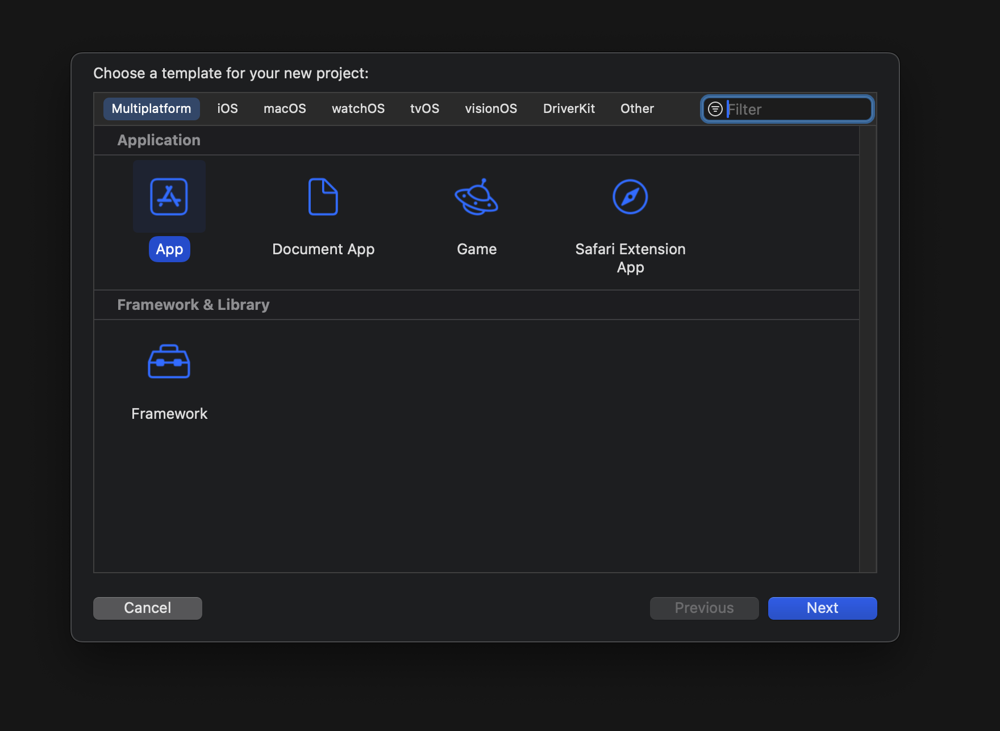
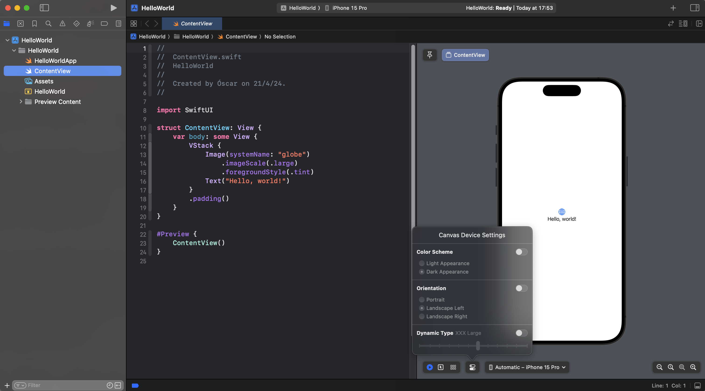
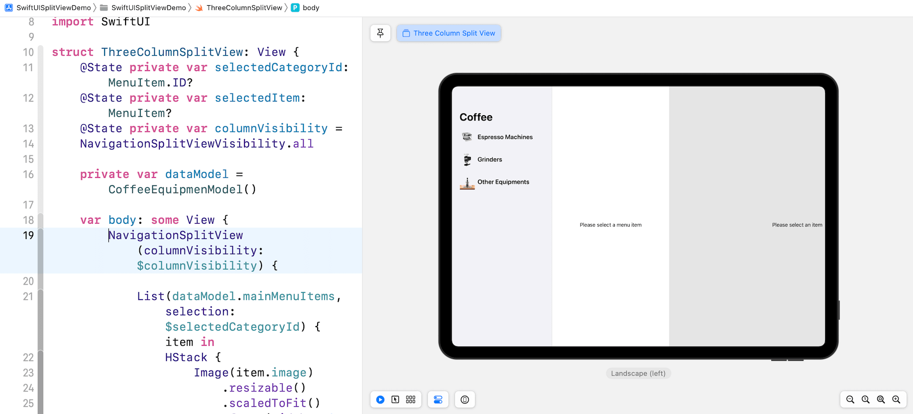

+++
title = "Asegurar la compatibilidad de las apps para el ecosistema de Apple"
description = "Swift facilita poder crear apps para varios dispositivos, pero debemos asegurar su compatibilidad"
summary = "Swift facilita poder crear apps para varios dispositivos, pero debemos asegurar su compatibilidad"
date = 2024-04-25
translationKey = "compatibilidad-ecosistema-apple"
+++

Una de las principales ventajas que tiene desarrollar apps de forma nativa para Apple, es que con el mismo lenguaje (Swift) y el mismo framework de UI (SwiftUI) puedes crear apps para todos sus dispositivos.

No obstante, existen sutiles diferencias entre dichos dispositivos. Y a su vez, entre distintas versiones de éstos.

Por eso, puedes dar un paso más allá en el desarrollo de tus productos si tienes en cuenta algunos factores, consiguiendo para tus usuarios una mejor experiencia.

Por eso, hoy te quiero exponer estos detalles

## Diseño responsivo

Gracias a SwiftUI, no es necesario realizar los ajustes en las constraints como ocurría con UIKit, que permitían definir las distancias entre elementos, y con respecto al borde de la pantalla. Por lo que en ese sentido, no debes preocuparte.

Pero, lo que sí debes tener en cuenta, es que utilizar los tamaños dínamicos, y las fuentes facilitadas por Apple, permiten asegurar esa compatibilidad en lo que respecta a la interfaz. Además, se simplifica y agiliza la parte de desarrollo.

Puedes encontrar más info, en la documentación oficial de SwiftUI: [Aplicando a una fuerte soporte de tamaño dinámico](https://developer.apple.com/documentation/swiftui/applying-custom-fonts-to-text#Apply-a-font-supporting-dynamic-sizing)

Además, gracias a la previsualización de SwiftUI, puedes comprobar como quedarán las vistas en varios dispositivos de forma simultánea.

## Crea una app multiplataforma

Xcode permite la creación de apps multiplataforma, de esta forma, no habrán targets diferentes para iOS y macOS.

## Crea un diseño dinámico

Existen [modificadores de diseño](https://developer.apple.com/documentation/swiftui/view-layout) en SwiftUI que te permiten ajustar como se mostrará la vista, en función por ejemplo, del valor de una variable (vinculada por ejemplo a las subvistas que existan)

## Utiliza una versión mínima de sistema reciente

Apple se preocupa por esta compatibilidad, ya que le supone un enorme beneficio que a sus usuarios les suponga una ventaja tener sus dispositivos. Es de gran comodidad hacer una foto con el iPhone, verla en el iPad, y después editarla con el Macbook Pro.

Y esto es algo que cada vez tiene más en cuenta, por eso las versiones más recientes facilitarán la integración y compatibilidad para que una app se pueda usar en todos esos dispositivos.

## No te olvides del modo oscuro

Otro detalle importante que puedes ver en la previsualización de SwiftUI, es que con simple click puedes comprobar como se ve tu app en modo claro u oscuro.

Esta es una característica que cada vez se usa más por parte de los usuarios, no solo por elegir el modo que visualmente más le atraiga. Muchas veces viene configurado de forma automática. De esta forma, de día veremos el modo claro, y de noche el modo oscuro.

Por este motivo, también es muy importante, utilizar en la medida de lo posible los colores y modificadores que facilita SwiftUI, para que tengan sus distintas versiones de colores.

## Prueba diferentes disposiciones de pantallas

En ocasiones, los usuarios prefieren utilizar el dispositivo en modo vertical, o en modo horizontal.

Sí, de nuevo, gracias a SwiftUI y no tener que depender de las constraints, nos ha facilitado los desarrollos. Pero es importante comprobar (también en la preview) como se mostrarán las vistas en las distintas orientaciones de pantalla.

## Considera las vistas de iPad

SwiftUI cuenta con el protocolo [NavigationSplitViewStyle](https://developer.apple.com/documentation/SwiftUI/NavigationSplitViewStyle) para poder mostrar vistas divididas en paneles.

El ejemplo más claro es en la app de Correo, donde se muestran, de izquierda a derecha:

- Los distintos buzones
- El contenido del buzón
- El mensaje seleccionado de ese buzón.

Esto es útil para colecciones, que tengan a su vez información anidada

Pero recuerda comprobar el resultado en la previsualización de cada dispositivo.

## Aprovecha las capacidades únicas de cada dispositivo

Aunque desarrollar una app que funcione a través de múltiples dispositivos es crucial, también es esencial aprovechar las capacidades únicas de cada uno.

Por ejemplo, el Apple Watch ofrece funcionalidades de salud únicas, mientras que el Apple TV puede centrarse en capacidades multimedia.

Asegúrate de diseñar tu app no solo para que sea compatible, sino también para que explote al máximo las características específicas de cada dispositivo.

## Gestión del estado del dispositivo

Es fundamental gestionar el estado del dispositivo al diseñar para múltiples plataformas.

Esto incluye manejar cambios como la rotación de la pantalla, interrupciones como llamadas entrantes o alertas, y ajustes del sistema como los cambios en las configuraciones de accesibilidad.

Escucha los eventos del sistema y responde adecuadamente para asegurar una experiencia fluida y coherente en todos los dispositivos.

## Conclusión

Como has podido, comprobar todos los aspectos a tener en cuenta, se pueden resumir en dos:

- Utilizar los elementos que facilita Apple de forma nativo
- Previsualizar los resultados en los distintos dispositivos de destino.

Esto hará que puedas aprovechar una de las fortalezas de la compañía de Cupertino: la experiencia de uso de su ecosistema.
