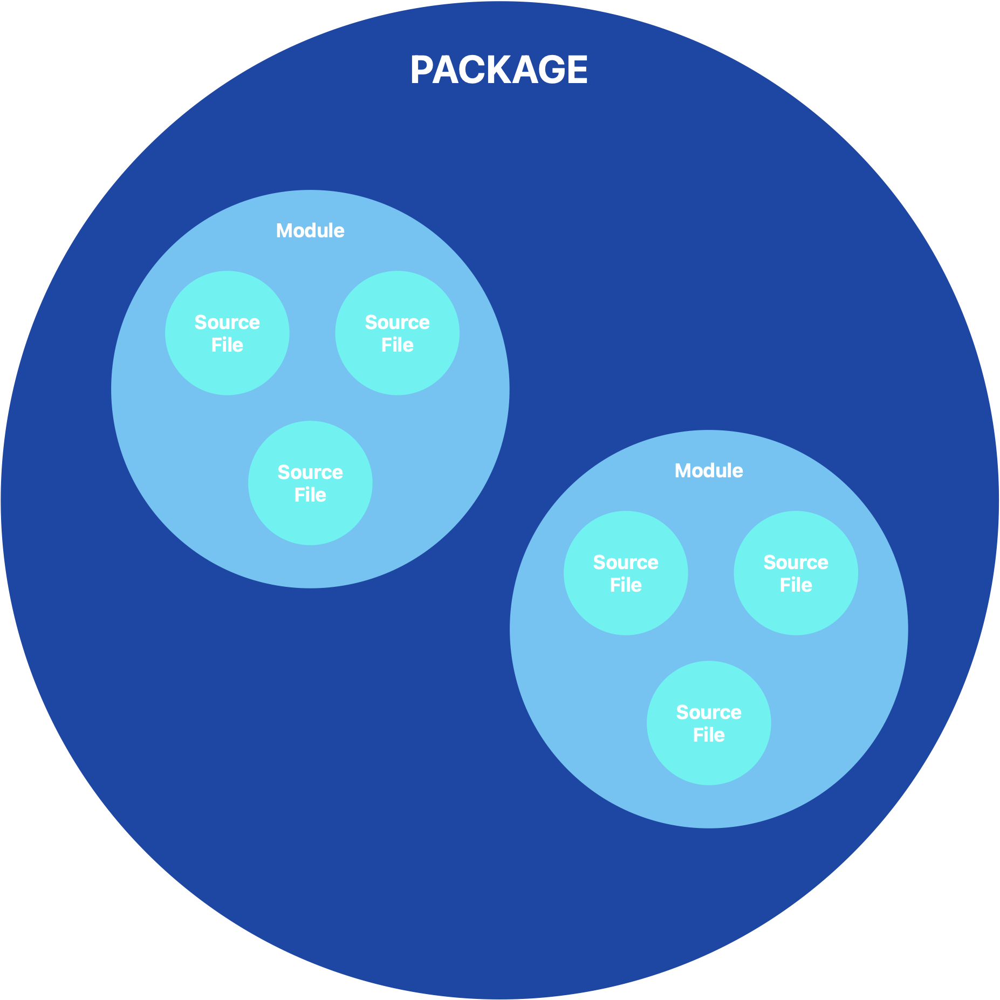

+++
title = "Qué significan los distintos niveles de acceso en Swift"
description = "Los niveles de acceso definen desde dónde se puede acceder a tu código"
summary = "Los niveles de acceso definen desde dónde se puede acceder a tu código"
date = 2024-09-03T08:00:00+02:00
translationKey = "nivelesAcceso"
+++

En (muchas) ocasiones, debes pasar más tiempo leyendo código que escribiéndolo, por eso es clave entender lo que lees. 

Además, es una buena forma de aprender más conceptos de programación.

¿Sabes en qué se diferencia `open` de `public`?¿Por qué no es lo mismo `fileprivate` que `private`?

Saber esto, evita que pierdas el tiempo con errores en los que a veces no encontrarás explicación, y te ayudará a estructurar mejor tu aplicación.

El **control de acceso** permite gestionar el acceso a determinadas partes de tu código desde otras partes del mismo. Esto te permite ocultar los detalles de implementación de tipos, propiedades, funciones... (a los que llamaremos entidades)

No siempre es necesario utilizarlos, ya que Swift facilita un nivel de acceso predeterminado para los escenarios más básicos.

## Ficheros fuente, módulos y paquetes

Antes de seguir, es importante que conozcas los siguientes elementos para entender desde donde podrás acceder.

### Fichero fuente

Un **fichero fuente** (source file) es un fichero con extensión .swift que se encuentra dentro de un módulo.

Ten en cuenta que normalmente se define cada tipo (clase, estructura o enumeración) en un fichero fuente, pero en ocasiones pueden haber varios relacionados en el mismo.

### Módulo

Un **módulo** es una unidad de distribución de código.

Puede ser un framework o una aplicación, que formará una unidad.

Los módulos pueden importarte desde otros módulos usando la palabra clave `import`

### Paquete

Un **paquete** es un grupo de modulos que forman una unidad.

Cuando se crea un paquete, se deben especificar los módulos que va a contener.



## Niveles de acceso en Swift

Ahora puedes ver los distintos niveles ordenados de menor a mayor restricción.

### open

Cuando una entidad está definida con `open`, podrás acceder a ella desde cualquier fichero fuente que se encuentre en el mismo módulo.

Y además, también desde ficheros fuente de otros módulos, que importen el módulo que contienen dicha entidad.

Por otro lado, permite acceder desde subclases o sobreescribir métodos desde fuera del módulo (overriding).

Lo debes utilizar cuando crees una interfaz pública de un framework.

### public

Utilizar `public` es casi lo mismo que `open`.

La diferencia es que en el caso de public, no puedes acceder desde subclases ni sobescribir métodos.

### package

Este acceso está disponible desde Swift 5.9

Como habrás intuido, permite acceder desde cualquier fichero fuente dentro del mismo [paquete](#paquete)

### internal

El uso de `internal` permite acceder desde cualquier fichero fuente del mismo módulo, pero no de distintos módulos.

Es habitual utilizarlo cuando se define la estructura de una app o framework sencillo.

Seguramente apenas lo verás, ya que es el que se utiliza por defecto. Es decir, si no ves ningún control de acceso antes de la palabra clave de la entidad (`struct`, `class`, `let`, `var`, etc... ) Es porque está utilizando `internal`.

### fileprivate

En este caso, con `fileprivate` solo se podrá acceder a estas entidades desde el mismo fichero fuente que lo contenga.

De esta forma, si por ejemplo en un fichero .swift tienes distintas clases y estructuras, la que esté marcada con `fileprivate` podrá ser accedida desde el resto de clases y estructuras de ese mismo fichero.

### private

Por último, `private` solo permite acceder a su contenido desde su declaración.

Es decir, si una clase está marcada con este control de acceso, solo se podrán acceder a sus entidades, desde dentro de dicha clase.

## Cómo usar los niveles de acceso en Swift

Para usar los distintos niveles simplemente tienes que indicarlo delante de la palabra clave de la entidad.

Mira los siguientes ejemplos:

```swift
open class MyClass {}

public struct MyStruct {}

internal let myConstant = "Hello World!"

fileprivate var myVar = "Hello again!"
v
private func myMethod() {}
```

## Principio de los niveles de acceso

Los distintos niveles de acceso siguen un principio general:


No se puede definir ninguna entidad dentro de otra entidad que tenga un nivel de acceso inferior (más restrictivo)


Es decir, no puedes definir una variable pública dentro de una clase privada; ni puedes definir una variable abierta, en un método interno.

## Nivel de acceso predeterminado

El nivel de acceso por defecto es `internal`, por lo que si no indicas nada antes de la entidad, será éste el que tome.

## Conclusión

Has visto los distintos niveles de acceso: `open`, `public`, `internal`, `fileprivate` y `private`, y las restricciones que implican cada uno de ello.

Es importante utilizar el adecuado para mantener un *código limpio, organizado, y eficiente*, permitiendo el acceso únicamente a quien lo necesite.

Recuerda que si no indicas nada, Swift considerará la entidad como `internal`.

## Fuentes

[Control de acceso - Documentación de Swift](https://docs.swift.org/swift-book/documentation/the-swift-programming-language/accesscontrol/)
